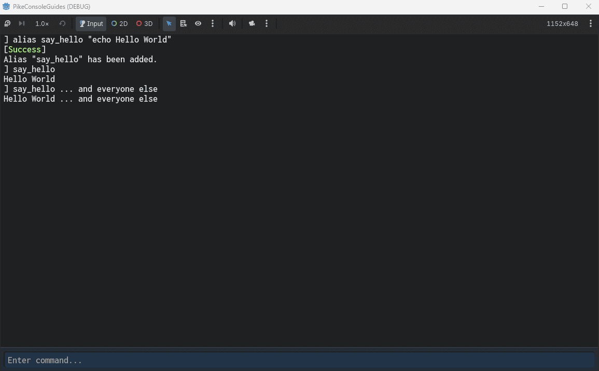
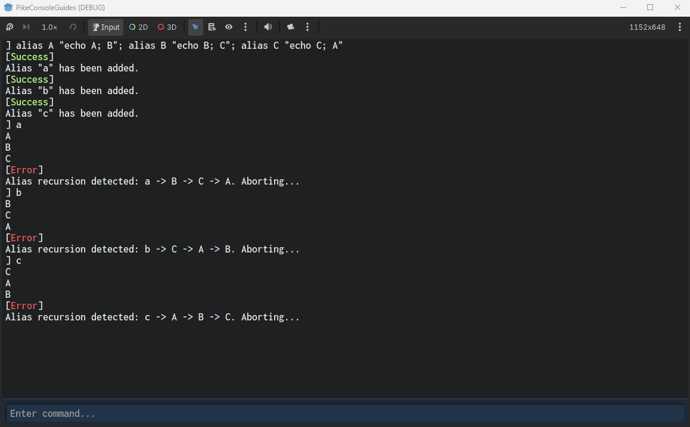

# Aliases

## 🤔 What are aliases?  

Aliases are console statements that are collected under a different signature.  
An alias does not care if it is valid or not. It's just a statement bound to a temporary signature.  

What differs aliases from [CVars](cvars.md) and [Commands](commands.md) is that they are runtime only and will not survive a session restart.  
To "save" an alias, one must store it in a `.ecfg` file and execute that on startup.  

## 🔨 How to create an alias

To create an alias, use the `alias` command!  

```
alias say_hello "echo Hello World"
```

/// warning | Note
Aliases can only take exactly 1 argument. Thus, they need to be wrapped in quotes.  
If you need to use quotes within the alias itself, use an escape character: `\"`
///

Since aliases are just statements, we can also append arguments on them, making them very versitile!  
```
say_hello ... and everyone else
```



## 🛡️ Built in recursion protection

A common issue with aliases in developer consoles is that complex alias trees sometimes cause infinite loops.  
This could freeze the main thread and crash the game.  

PikeConsole comes with automatic recursion detection and protection though. Allowing aliases to run until they become recursive.  

Try this statement:  
```
alias A "echo A; B"; alias B "echo B; C"; alias C "echo C; A"
```

Once all aliases are registered, try running any of them (`A`, `B` or `C`) and see what happens:  

  

## 📙 Other resources

* [Getting Started](getting_started.md) (Recommended)
* [Logging](logging.md) (Recommended)
* [Best Practices](best_practices.md) (Recommended)
* [Cvars](cvars.md)
* [Commands](commands.md)
* [Aliases](aliases.md)
* [User Configs](user_configs.md)
* [Video Guides](video_guides.md)