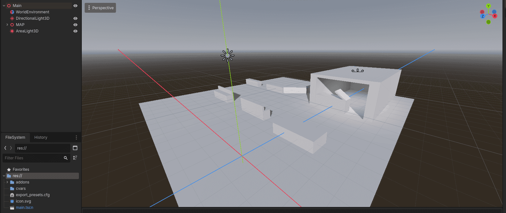
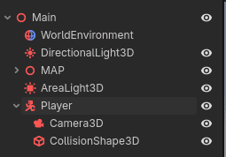
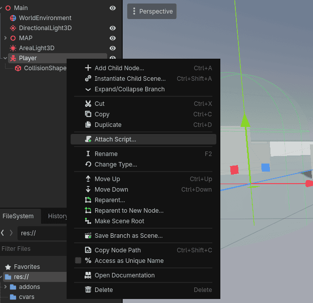
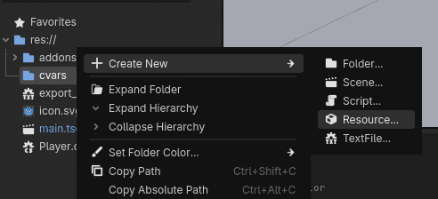
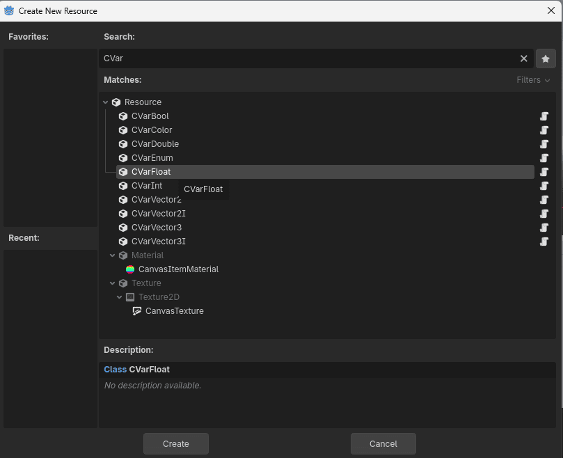
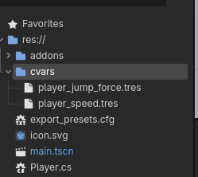
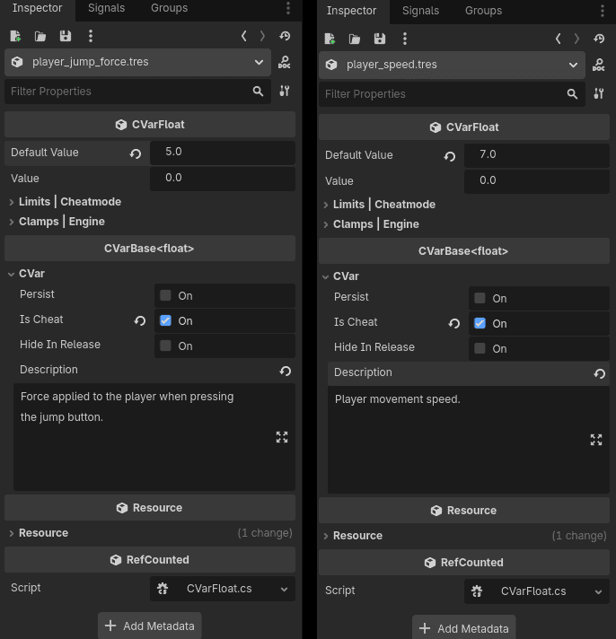
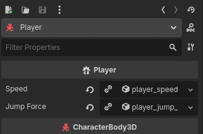
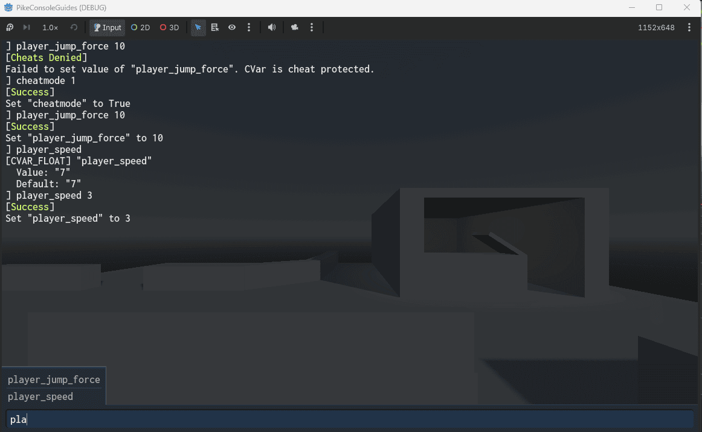

# CVars - The what, how and when!

This guide will go through the ins and outs of CVars, or "console variables" as they are commonly referred.  
Here you will learn everything from what a CVar is, when they come in handy and how you can start using them today!  

## ❓ What is a CVar?  

### 📦 It's a data container
A CVar, or console variable, is an instantiated structure of static data that is automatically managed by the runtime execution system.  
This creates a single source of truth that is editable and observable from many other systems.  

More or less all player settings should be CVars, such as _head bob intensity_, _crosshair settings_ and _lod distance_.  
This centralizes the player settings to one system that both the console, UI and game can read from at runtime.  

There are however more systems that can benefit from running CVars, such as player movement.  
A famous example is how **Half-Life** uses the CVars `sv_accelerate`, `sv_gravity` and `sv_airaccelerate` for their player movement.  
For players these are just fun cheats, for us developers it's the ultimate tool for rapid iteration! 

### 🛜 But it's also a command...  

CVars themselves are dumb, Godot native, resource files that you can drag and drop in the inspector.  
At runtime however, each CVar is automatically registered as a command, or [`IRuntimeExecutable`](../api/RuntimeExecution/IRuntimeExecutable.md) as it's called in PikeConsole.  
This is an automatic process handled by the CVarCrawler in tandem with the [`CVarBase<T>`](../api/RuntimeExecution/CVars/Extensions/CVarBase_T.md), which goes through the specified `cvars` directory and initializes all resources.  
When a CVar is added to the `RuntimeExecutableRegistry` it will automatically be executable and discoverable by PikeConsole.

## 🤔 When should I use a CVar?  
A CVar can be used as a replacement for any other variable of the same type, however, not all variables should be CVars.  
There are mainly 2 situations you'd want to be using CVars.  

**Settings** 
It is recommended to have all (or nearly all) player settings be CVars as this will allow PikeConsole's default User configuration system to keep persistent CVars.  
This means that PikeConsole will automatically manage user settings initialization and saving. It also comes with built in multi-profile capability!  
An added bonus that fans of the Goldsrc engine will like is that power-users can fine-tweak their settings in the console instead of using the provided GUI.  

**Global state (GamePlay & Environment modifiers)**  
Other than that you should use CVars for any variable that you, or someone else in your team potentially want to tweak and turn.  
This could be anything from the _player movement speed_, _head bob multiplier_, _weapon bob multiplier_, _player jump height_, _enemy spawn rate_ and more...  
The benefit of using CVars is that these values will now be tweakable at runtime, which means quick iteration and asynchronous development (the programmer doesn't have to listen to everyones "can we try this" requests).  

Note that highly dynamic values, such as _player health_ or _current ammo_ should **not** be CVars.  
It would instead be better to create a [Command](commands.md) to manage these values at runtime!  

## 🔨 How to create a CVar

Creating a CVar is super easy. For this demonstration, we will do it step-by-step from the absolute beginning.  
At the end of this section, we've attached CVars to control the players `jump height` and `movement speed`...  

Start off by boxing out a small 3D level using `CSGBox` Nodes.  

 

Beautiful.  
Now Just add a player. We'll use the default `CharacterBody3D` Node.
Add it to the scene and add both a `CollisionShape3D` and a `Camera3D` to it.  

 

Now just right click the `CharacterBody3D` and press attach scrip.

 

use the generated code as a base, or copy and paste the following:  
```csharp {linenums="1"}
using Godot;

namespace FractalPike.PikeConsoleGuide;

public partial class Player : CharacterBody3D
{
	[Export] float _speed = 5.0f;
	[Export] float _jumpForce = 4.5f;

	public override void _PhysicsProcess(double delta)
	{
		Vector3 velocity = Velocity;

		// Add the gravity.
		if (!IsOnFloor())
		{
			velocity += GetGravity() * (float)delta;
		}

		// Handle Jump.
		if (Input.IsActionJustPressed("ui_accept") && IsOnFloor())
		{
			velocity.Y = _jumpForce;
		}

		// Get the input direction and handle the movement/deceleration.
		// As good practice, you should replace UI actions with custom gameplay actions.
		Vector2 inputDir = Input.GetVector("ui_left", "ui_right", "ui_up", "ui_down");
		Vector3 direction = (Transform.Basis * new Vector3(inputDir.X, 0, inputDir.Y)).Normalized();
		if (direction != Vector3.Zero)
		{
			velocity.X = direction.X * _speed;
			velocity.Z = direction.Z * _speed;
		}
		else
		{
			velocity.X = Mathf.MoveToward(Velocity.X, 0, _speed);
			velocity.Z = Mathf.MoveToward(Velocity.Z, 0, _speed);
		}

		Velocity = velocity;
		MoveAndSlide();
	}
}
```

Now we have a Player that can move around the scene freely (though without mouse-look).  
In this scenario it would be good to have the speed and jump height be CVars so that we can tweak and test them at runtime.  
Let's create some Cvars!  

Right click the `cvars` folder located in `res://` and press new resource.  

 

Search for `CVar` and pick `CVarFloat`.  

 

Name the CVar after the signature you want.  
Make sure it's all lowercase and uses underscores instead of spaces.  
For this example, we will call the CVars `player_speed.tres` and `player_jump_force.tres`.  

 

Now go into each CVar and set the default values in the inspector.  
Since these CVars are manage the player speed and jump height, we will also tick the "Is Cheat" box (this makes the CVar inaccessible without `cheatmode` on).  

  

Now open the code and replace the old `float` variables with `CVarFloat` instead.  
Then access them with `_speed.Value` and `_jumpForce.Value`, like so:  

```csharp {linenums="1"}
using FractalPike.PikeConsole.Core.RuntimeExecution.Cvars;
using Godot;

namespace FractalPike.PikeConsoleGuide;

public partial class Player : CharacterBody3D
{
	[Export] CVarFloat _speed;
	[Export] CVarFloat _jumpForce;

	public override void _PhysicsProcess(double delta)
	{
		Vector3 velocity = Velocity;

		// Add the gravity.
		if (!IsOnFloor())
		{
			velocity += GetGravity() * (float)delta;
		}

		// Handle Jump.
		if (Input.IsActionJustPressed("ui_accept") && IsOnFloor())
		{
			velocity.Y = _jumpForce.Value;
		}

		// Get the input direction and handle the movement/deceleration.
		// As good practice, you should replace UI actions with custom gameplay actions.
		Vector2 inputDir = Input.GetVector("ui_left", "ui_right", "ui_up", "ui_down");
		Vector3 direction = (Transform.Basis * new Vector3(inputDir.X, 0, inputDir.Y)).Normalized();

		// Caching speed. This is over-optimization but I lowkey can't help myself.
		float speed = _speed.Value;

		if (direction != Vector3.Zero)
		{

			velocity.X = direction.X * speed;
			velocity.Z = direction.Z * speed;
		}
		else
		{
			velocity.X = Mathf.MoveToward(Velocity.X, 0, speed);
			velocity.Z = Mathf.MoveToward(Velocity.Z, 0, speed);
		}

		Velocity = velocity;
		MoveAndSlide();
	}
}
```  

/// tip | Performance Note
PikeConsole CVars are designed for the hot path. While they inherit from Resource to provide Godot Inspector integration, the underlying data lives entirely in the .NET runtime. Calling `_speed.Value` bypasses interop entirely, which is fast.
///

Save and build the project using hammer icon, then drag and drop the CVars from the file explorer to the exported references in the Player inspector.  

  

Now if you enter the game and press the ++tilde++ key to open the console, you'll be able to edit your CVars and see it affect your game!  

/// note
Since we set the "Is cheat" flag, we must first set the `cheatmode` CVar to true.  
Enter the following command:  
```
cheatmode 1
```
///

  

## 📙 Other resources

* [Getting Started](getting_started.md) (Recommended)
* [Best Practices](best_practices.md) (Recommended)
* [Commands](logging.md)
* [Aliases](aliases.md)
* [User Configs](user_configs.md)

* [CVar API ref](../api/RuntimeExecution/CVars/Extensions/CVarBase_T.md) (Recommended)