# Getting started with PikeConsole  
In this guide you will learn to install the project and execute your first command in about 3 minutes!  

## Installing the addon
### 1️⃣ Download the project  
Go to the [releases tab](https://github.com/VonRiddarn/PikeConsole/releases) on Github and download the latest version of PikeConsole.  
The file should be called something like: `PikeConsole_v1.0.0.zip` (the version number at the end may vary).  

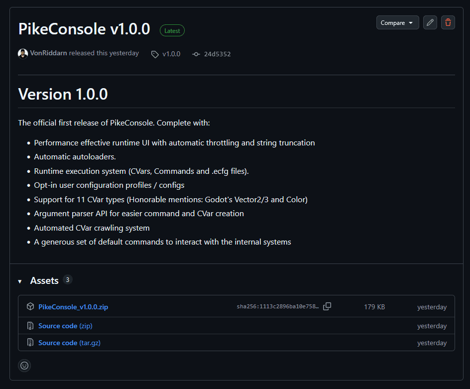  

### 2️⃣ Install and activate the addon  
Once downloaded, drag and drop the `addons` folder into your Godot project's `res://` folder.  
If you are prompted to merge, do so.  

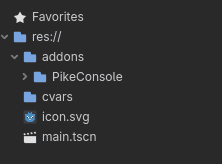 

///note
If you are already running an older version of PikeConsole, the best way to install the addon is to fully delete the old folder beforehand.  
**Always** backup your old version before changing if you are upgrading to a new major release (first number in the versioning sequence).
///

### 3️⃣ Activate the addon in your project settings
At the top of your editor, press the `Project` tab and go to `Project settings`.  
Go to the `Plugins` tab and make sure to enable `PikeConsole` by **Timmy "VonRiddarn" Öhman**.  

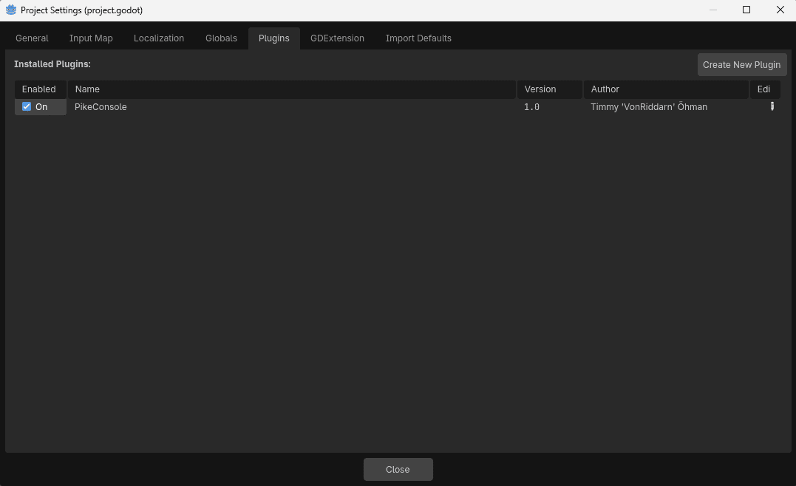

You should be rewarded with some initialization logs in the output window.  

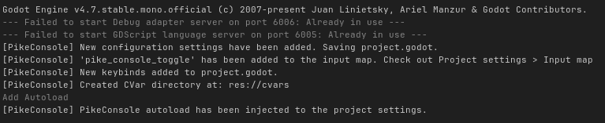

### 4️⃣ Start the project!  
Launch the project and press the ++tilde++ (tilde) key to open the console!  

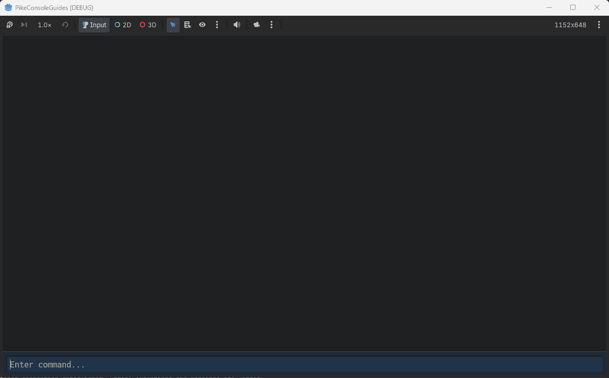 

///note
The console action key is the button to the left of ++1++ by default.  
If you are using a non-english keyboard, it's stil the same key even if marked different.  
For Swedish keyboards, it's the `§` key.
///

#### 🆘 It didn't work   
If you tried starting the game and ran into the following (or similar) errors:  

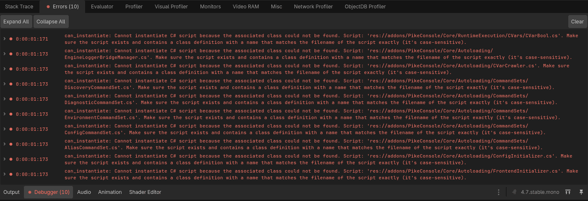 

That means you're trying to run from a project that has never been compiled and is missing a `.csproj` file.  
To create one, press the `Project` tab at the top and navigate to: `Tools` > `C#` > `Create C# Solution`.  

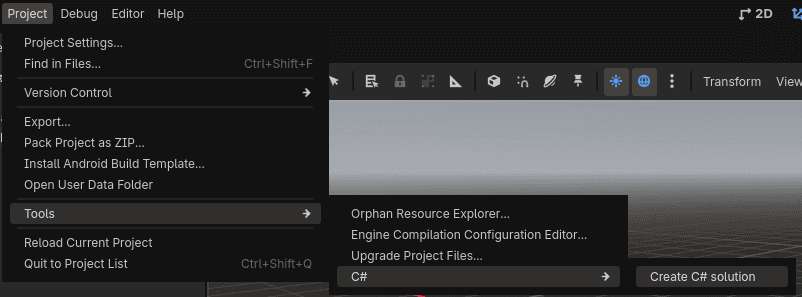 

If successfull, you will notice the _build hammer_ appearing at the top, next to the play button.  
This means the solution file has been created and you can run the game again.  

#### ⚠️ Fix your privacy settings  
PikeConsole uses lots of cool tricks to reach such high performance.  
One of these tricks is using compile-time string constants for filepaths when self-diagnosing (or externaly invoking an error / warning message).  

This means that if you're using a personal computer to create the game, your filepath will be baked into the release diagnostic messages.  

Everyone playing a game made on my PC would get the following filepath when an error occurs:

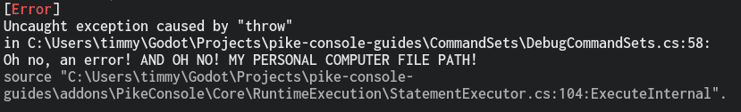 

Whilst this is not fatal and does not cause harm to the game, you might want to occlude this path both for privacy and professional reasons.  
This will require you to edit your `.csproj` file. To do so, follow these steps:  

**1️⃣ Locate and edit the `.csproj` file**  
The `.csproj` file is not shown in the Godot editor by default, so you will have to navigate into your folder manually.  
You can do this through the file explorer or directly through your IDE if you're using something like VSCodium / VSCode.  

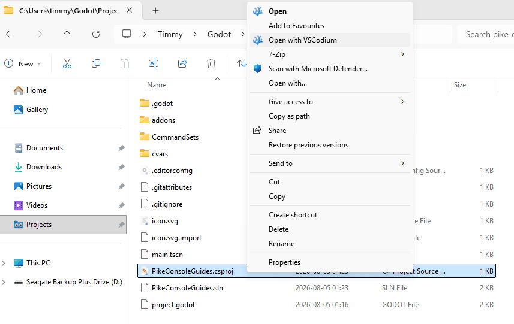 

**2️⃣ Edit the `.csproj` file**  

Once the file is open, you will see some XML code.

What we need to do is add a `<PathMap>` parameter inside the `<PropertyGroup>`.  
You can copy and paste this code (**do not remove the slash before the directory name**):  
```xml
<PathMap>$(MSBuildProjectDirectory)=/MyProjectName</PathMap>
```  

Now the `.csproj` file should look something like this:  
```xml
<Project Sdk="Godot.NET.Sdk/4.7.0">
  <PropertyGroup>
    <TargetFramework>net8.0</TargetFramework>
    <TargetFramework Condition=" '$(GodotTargetPlatform)' == 'android' ">net9.0</TargetFramework>
    <EnableDynamicLoading>true</EnableDynamicLoading>
	<PathMap>$(MSBuildProjectDirectory)=/PikeConsoleGuide</PathMap>
  </PropertyGroup>
</Project>
```

**3️⃣ Update your project settings**  
By this point your privacy is safe, but we have introduced a discrepency in how PikeConsole reads file locations.  
This means any errors passed to the editor output will not be clickable. To fix this press the `Project` tab and go to `Project Settings (General)`.  

Make sure advanced settings are enabled and navigate to `Fractal Pike` > `Pike Console`.  
In the option for `Pathmap` fill in the **exact** same value as you used in the `.csproj` file, including the slash.  
For me, it'll be `/PikeConsoleGuide`.  

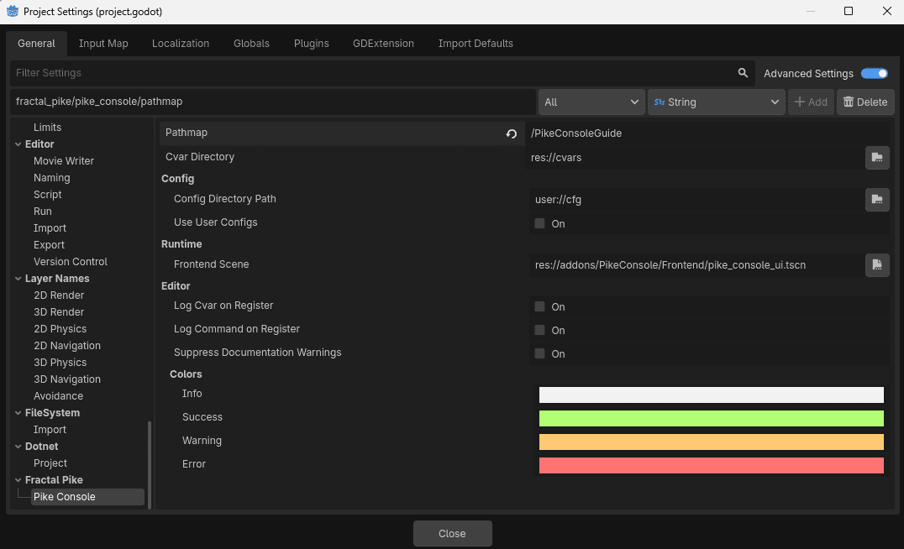 

**🎉 THAT'S IT!**  

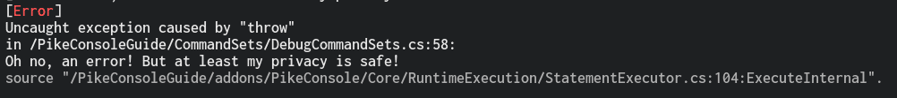 

## Try out the commands
### 🐣 Execute your first command
Now that you've gotten the console up and running, take it for a spin with a command!  
It would be sinfull to do anything other than starting out with a "Hello World" print, so let's do that.  

Type into the input box:  
```
echo Hello world!
```  

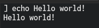 

**Bask in the glory of your creation!**  

### 🧠 Use quotes and separators  

For starters, PikeConsole can use quotes to include spaces in arguments.  
Use the `count` command and check out the difference between these inputs.  

```
count Hello world how are you today?
```

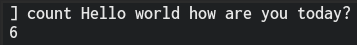 

```
count "Hello world how are you today?"
```  

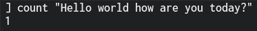 

Trippy, right!  

How about you check out your hardware specs while we're at it?  

```
env_gc; env_info; env_mem;
```

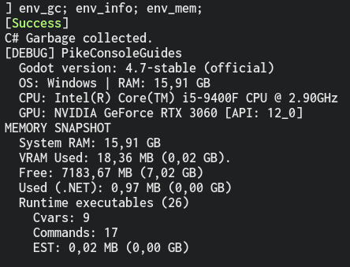 

As you can see, we entered 3 commands at once here! We can use semicolons `;` as separators to include more than one command in our statement!  

### 🤔 Get help and find files  

Feeling lost? That's fine!  

Sometimes console commands can get overwhelming, especially when most of them were written and forgotten months ago.  
How about we check out the `help` command and see what all these last commands actually did...  

```
help env_gc; help env_info; help env_mem;
```

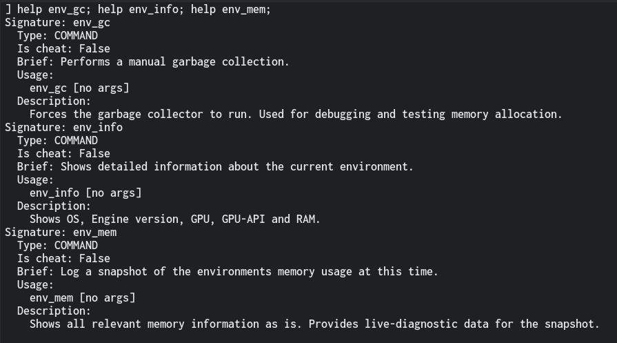 

That's cool! But it doesn't really tell us much about the code implementation.  
I've forgotten where that is, but we can solve that easily with the `whereis` command!  

```
whereis env_gc env_info env_mem
```  

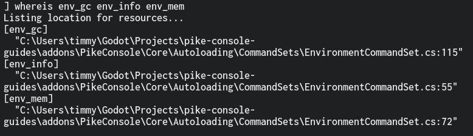 

Ah, that's where I put them.

///note
The `help` and `whereis` commands are META commands that will automatically work with **all** commands and cvars.
///

## 📙 Other resources

* [Logging](logging.md) (Recommended)
* [Best Practices](best_practices.md) (Recommended)
* [Cvars](cvars.md)
* [Commands](commands.md)
* [Aliases](aliases.md)
* [User Configs](user_configs.md)
* [Video Guides](video_guides.md)