# Logging

This guide will go through how to log in PikeConsole, and what benefits it brings.  
It is highly recommended that you have completed the [Getting Started Guide](getting_started.md) before proceeding.  

Or at the very least, the [Privacy concern chapter](getting_started.md#fix-your-privacy-settings).

## 🪵 How to log  
Logging in PikeConsole is both easy and performant!  
We will use the built in [`PikeLogger`](../api/Logging/PikeLogger.md) class, which automatically manages stuff like string optimization and target environments.  

First, we create a new Node and call it `TestLogger`.  
Then we'll make it log a simple "Hello world" to the console in the `_Ready()` method.  

```csharp {linenums="1"}
using FractalPike.PikeConsole.Core.Logging;
using Godot;

namespace FractalPike.PikeConsoleGuide;

public partial class TestLogger : Node
{
	public override void _Ready()
	{
		PikeLogger.Log(LogTarget.Runtime, $"Hello world!");
	}
}
```

If you start the game you'll see that the message is printed to the console!  

/// tip | ❗ Caveats of using PikeLogger 

You might\ve noticed that we needed to do a few extra steps here. Mainly passing a [`LogTarget`](../api/Logging/LogTarget.md) and having the message be an interpolated string.  
These restrictions are absolutely necessary in order for PikeConsole to strip and no-op logs in non-targeted environments.  
It uses a modern .NET technique called _String interpolation handlers_ which guarantees that strings will not build on non targeted environments, which increases performance and de-clutters the console overall.  
///

## ⚪🟢 Log levels 🟡🔴

[`PikeLogger`](../api/Logging/PikeLogger.md) has several log levels (severities) to use for different scenarios.  
In the following code example, we will expand on the previous code and show of each one in the `_Ready()` method.  

```csharp {linenums="1"}
using FractalPike.PikeConsole.Core.Logging;
using Godot;

namespace FractalPike.PikeConsoleGuide;

public partial class TestLogger : Node
{
	public override void _Ready()
	{
		PikeLogger.Log(LogTarget.Runtime, $"Hello world!");

		PikeLogger.LogSuccess(LogTarget.Runtime, $"Your game has been saved!");

		PikeLogger.LogWarning(LogTarget.Debug, $"High memory usage!");

		PikeLogger.LogError(LogTarget.All, $"Couldn't find the desired entity. Make sure the Node exists!");
	}
}
```

This leaves us with something like this:  

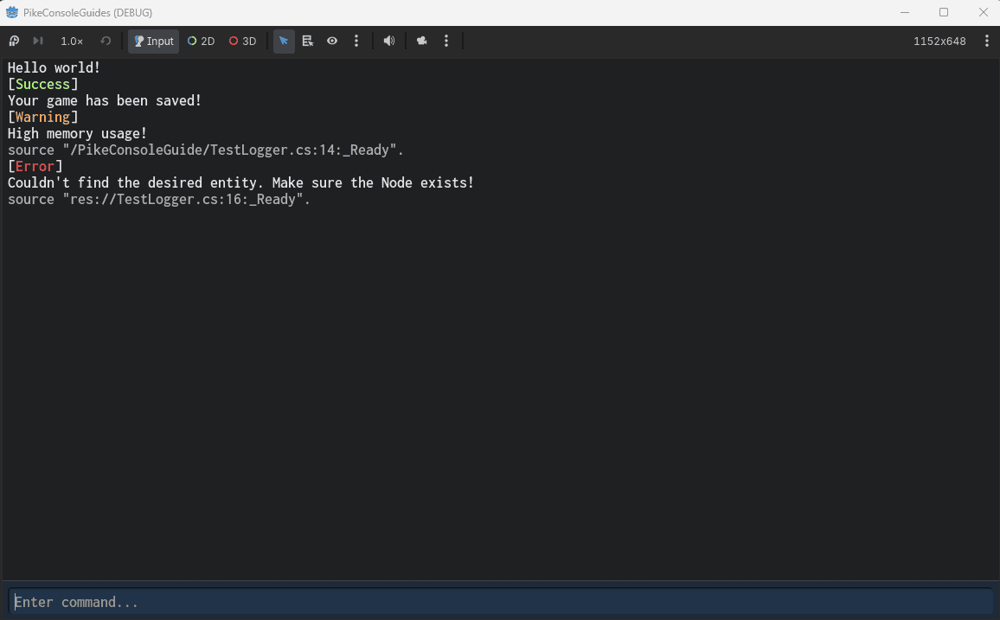 

Notice how the _warning_ and _error_ automatically attached the source file and method.  
This is part of the smart compile-time string literals!  

All [`PikeLogger`](../api/Logging/PikeLogger.md) methods come with overrides for explicitly _including_ or _not including_ the path.  
We can demonstrate this by adding a few more logs...  

```csharp {linenums="1"}
using FractalPike.PikeConsole.Core.Logging;
using Godot;

namespace FractalPike.PikeConsoleGuide;

public partial class TestLogger : Node
{
	public override void _Ready()
	{
		PikeLogger.Log(LogTarget.Runtime, $"Hello world!");

		PikeLogger.LogSuccess(LogTarget.Runtime, $"Your game has been saved!");

		PikeLogger.LogWarning(LogTarget.Debug, $"High memory usage!");

		PikeLogger.LogError(LogTarget.All, $"Couldn't find the desired entity. Make sure the Node exists!");

		PikeLogger.LogError(LogTarget.All, $"This is an error, but there is no source!", includePath: false);

		PikeLogger.LogSuccess(LogTarget.All, $"Wow, here's the source to your success!", includePath: true);
	}
}

```  

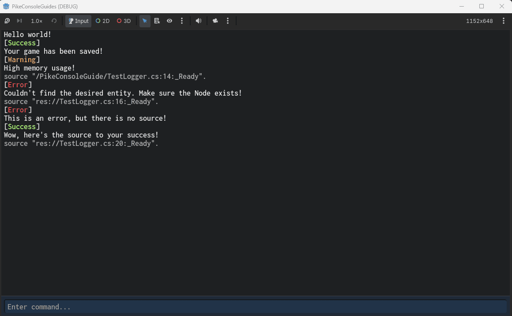 

## 🏷️ Log tags
Log tags are simply metadata that you can add to the log so that other systems can do something with it.  
PikeConsole uses log tags a lot in order to override headers and add things like styling capabilities to the frontend without crossing concerns.  
These tags could also, in theory, be used to filter logs if you make a custom UI.  

/// warning | Note
Log tags are not to be confused with log levels. The [`LogLevel`](../api/Logging/LogLevel.md) is decided by which method was called to emit the log, and is not affected by tags. Tags are a separate system with agnostic application! 
///

In this example, we will create a Node called `TagLogger`. Attach the following code:  

```csharp {linenums="1"}
using FractalPike.PikeConsole.Core.Logging;
using FractalPike.PikeConsole.Core.Utilities;
using Godot;

namespace FractalPike.PikeConsoleGuide;

public partial class TagLogger : Node
{
	public override void _Ready()
	{
		// LogTags is a static class included in PikeConsole. It contains string constants for log metadata.
		PikeLogger.LogWarning(LogTarget.Runtime, $"You called a method with bad arguments!", tags: [LogTags.InvalidArgs]);

		PikeLogger.Log(LogTarget.Runtime, $"Couldn't find entity with id 1337.", tags: [LogTags.NotFound]);

		PikeLogger.LogError(LogTarget.Runtime, $"Wait, this is an error message, but there's no header?", tags: [LogTags.NoHeader]);
	}
}
```  

PikeConsole's frontend will interperate these tags and automatically apply a fitting header (or not use a header inm the case of `LogTags.NoHeader`).  

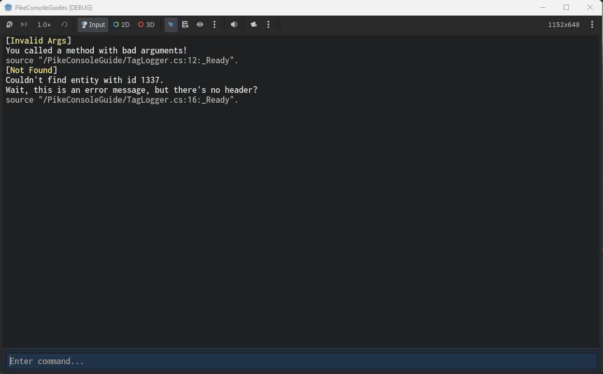 

## 🧩 Making your own headers

You do not need to use the default headers that come with PikeConsole. There exists a native way to expand the tag system without touching the source code!  
To do so go into your Goodt editor and navigate to `addons` > `PikeConsole` > `Frontend` > `pike_console_ui.tscn`.  

In the scene tree, click on the `LogStyler` Node.  

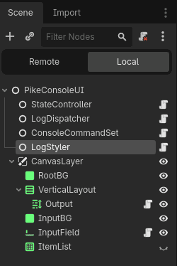 

In the inspector, go to `Header Overrides` and add an element to the `Header Overrides` array.  

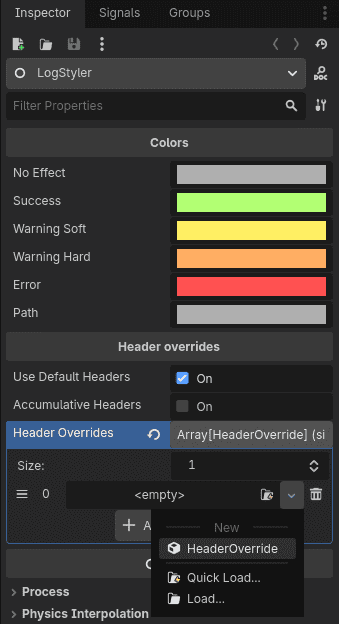 

Expand the new HeaderOverride and select a `tag`, `label` and `color`.  
In this example, I will use the tag `custom_tag` with the label `MY CUSTOM TAG`.  

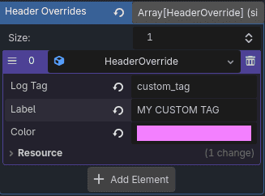 

Now, adjust the code example from before and make the error use your own custom tag instead:  

```csharp {linenums="1"}
using FractalPike.PikeConsole.Core.Logging;
using FractalPike.PikeConsole.Core.Utilities;
using Godot;

namespace FractalPike.PikeConsoleGuide;

public partial class TagLogger : Node
{
	public override void _Ready()
	{
		// LogTags is a static class included in PikeConsole. It contains string constants for log metadata.
		PikeLogger.LogWarning(LogTarget.Runtime, $"You called a method with bad arguments!", tags: [LogTags.InvalidArgs]);

		PikeLogger.Log(LogTarget.Runtime, $"Couldn't find entity with id 1337.", tags: [LogTags.NotFound]);

		PikeLogger.LogError(LogTarget.Runtime, $"Wait, this is an error message, but there's no header?", tags: ["custom_tag"]);
	}
}
```  

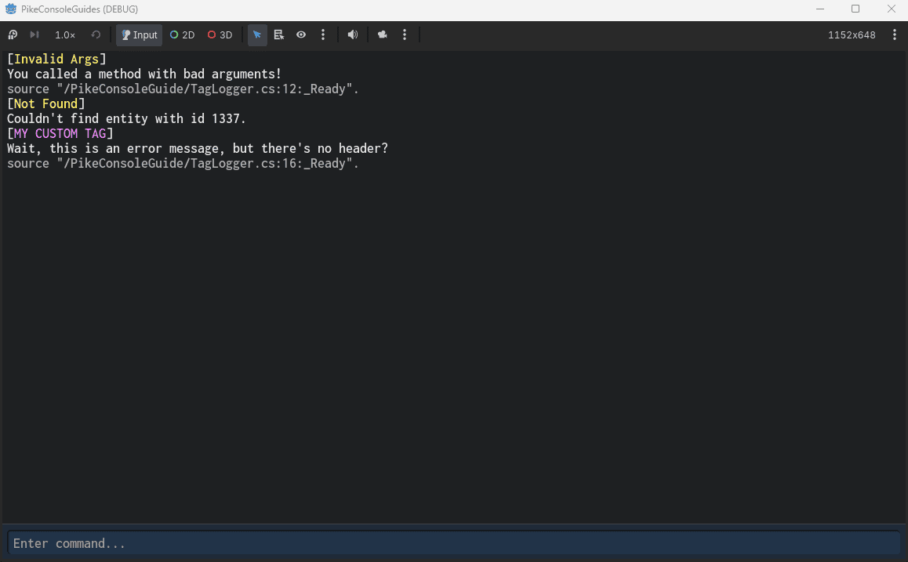 

## 🤔 Why interpolated strings?  
Forcing interpolated strings for **all** messages might seem overkill, but there is actually a good reason for it.  
In this example we will intentionally freeze our project to demonstrate how [`PikeLogger`](../api/Logging/PikeLogger.md) operates.  

Create a Node and call it `CrasherLog`, then apply the following code:  

```csharp {linenums="1"}
using FractalPike.PikeConsole.Core.Logging;
using Godot;

namespace FractalPike.PikeConsoleGuide;

public partial class CrasherLog : Node
{
	public override void _Ready()
	{
		PikeLogger.Log(LogTarget.Debug, $"The super heavy info payload for debugging is: {SuperHeavyMethod()}");

		PikeLogger.LogSuccess(LogTarget.Runtime, $"We're alive!");
	}

	static string SuperHeavyMethod()
	{
		bool freeze = true;

		while (freeze) { }

		// This cannot be reached due to the infinite loop above!
		return "Lots of data";
	}
}
```  

As you can probably already tell, this is catastrophic and will completely freeze the main thread.  
Playing this in a debug build (exported or through the editor) will crash the game.  
That means the string is being processed and the method is trying to run.  

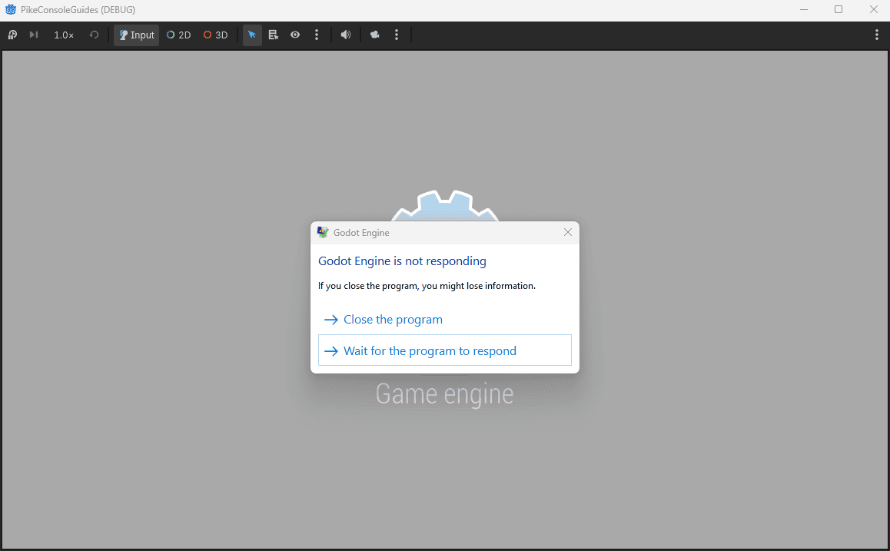 

**However**, if we build the game as a _release_ build and play, **it will not crash**!  

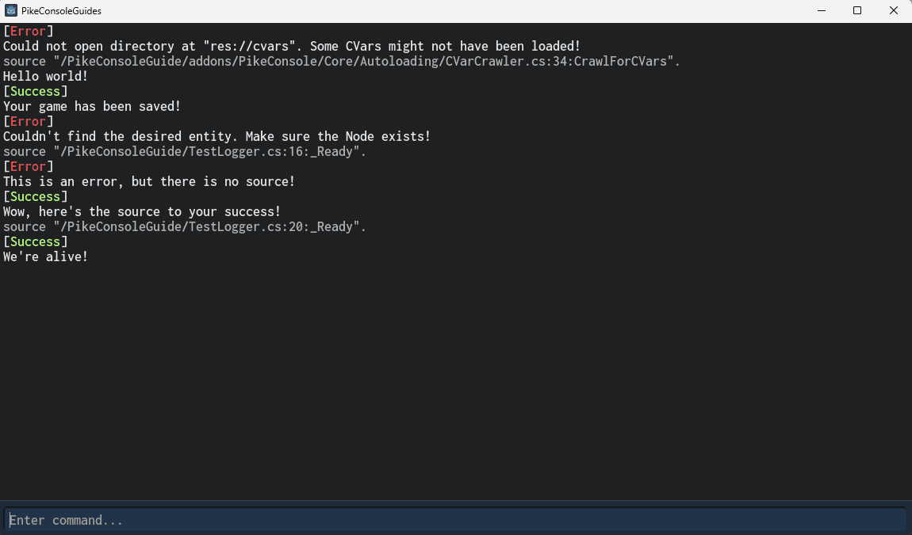 

This means that because we used `LogTarget.Debug`, the game will not even process the string in a release build!  
In this case we intentionally crashed the game to prove a point, but in a real world scenario you might compute a large amount of data and allocate memory to build a massive string of information, like network status, a snapshot of entity positions, etc...  

That's processing power that your player is paying for, even though they can't even read the logs.  
With PikeConsole all that goes away!  

It is also easier for players to error report, as they can send the output from the console rather than having to navigate to their user directory to find the Godot log files generated by `GD.Print`.

///note | Speaking of `GD.Print`
PikeLogger is meant as a full replacement and should be used instead of `GD.Print` in order to automatically save memory and performance. To mimic the effect of `GD.Print` without the performance costs, use the `Editor` [`LogTarget`](../api/Logging/LogTarget.md)!  

These methods will automatically become no-op in all compiled builds which increases performance.
///

## 📢 Automatic error routing  

When an error occurs in the engine or code, PikeConsole will automatically print it to the runtime console.  

/// note
Errors and warnings pushed manually using `GD.PushWarning` and `GD.PushError` will also be printed. 
This is for compatibility with old projects. Going forward, it's highly recomended to use `PikeLogger.LogError` / `PikeLogger.LogWarning` to reduce interop overhead!  
///  

To demonstrate this, create a Node and call it `ErrorLogger`. Attach the following code:  

```csharp {linenums="1"}
using Godot;

namespace FractalPike.PikeConsoleGuide;

public partial class ErrorLogger : Node
{
	public override void _Ready()
	{
		// Note, avoid these as these cause unnecessary interop.
		// Use PikeLogger.LogWarning() or PikeLogger.LogError() instead!
		GD.PushWarning("Warning from Godot!");
		GD.PushError("Error from Godot!!");

		int[] foo = [0, 1, 2, 3];

		// Out of bounds!
		int a = foo[4];

		// So the linter will stop complaining about the unused variable.
		GD.Print(a);
	}
}
```  

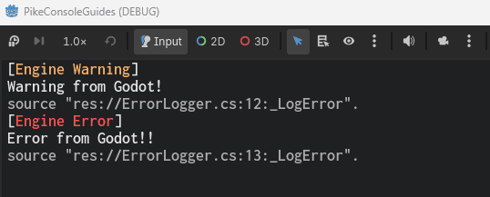 

And because we're running from the editor, we get the added benefit of PikeLogger automatically routing the errors (with clickable links) in the output!  

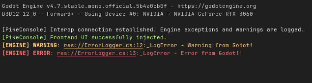  

## 📙 Other resources

* [Getting Started](getting_started.md) (Recommended)
* [Best Practices](best_practices.md) (Recommended)
* [Cvars](logging.md)
* [Commands](logging.md)
* [Aliases](aliases.md)
* [User Configs](user_configs.md)