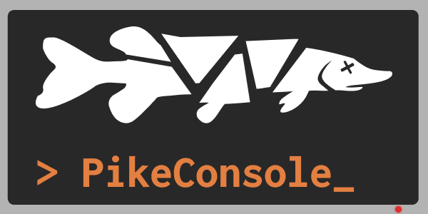

# PikeConsole - The modern GoldSrc-inspired console framework!  

	

Welcome to the official documentation for PikeConsole!  
This is a production-ready framework that provides high-performance, 
zero-allocation logging and command execution for Godot 4.6+!  

It is 100% AOT-compilation safe and provides everything from commands 
and CVars to user configs right out of the box! Whether you're looking for 
a runtime developer console, easy-to-use global state variables or just a more efficient logging 
system than the default `GD.Print` this is the tool for you!

/// note | Quick reminder
PikeConsole is provided "_as-is_".  
All versioning, upkeep and issue tracking are done when time allows for me to do so.  
///

## 🤔 Where to begin?
At the top of the page you've got tabs for any and all available root-pages at all times.  
If you're on mobile, these are inside the hamburger icon in the top left.  

The **Architecture & Framework** tab provides benchmarks and explanations regarding the different 
design decisions that went into the making of the framework. 
If you're looking for a more curated experience, you might want to start with:  

- **[Getting Started](guides/getting_started.md)**: Get the console setup and run your first command in less than 2 minutes!  
- **[Logging](guides/logging.md)**: Learn how to replace `GD.Print` with PikeLogger in just one line of code!
- **[Commands](guides/commands.md)**: Learn the inner workings of commands and create your own.  
- **[CVars](guides/cvars.md)**: Learn about CVars, how to use them and how to make your own. 

## ⚙️ Requirements  
* **Godot 4.6** _or later_.
* **.NET 8** _or later_.

## 🧙‍♂️ Deepest lore
PikeConsole was created by me, [Timmy Öhman](https://www.linkedin.com/in/timmyohman/) / ["VonRiddarn"](https://github.com/VonRiddarn) somewhere back in late 2022 to solve the fast iteration playtest issues me and my partner had at the time.  

I used to spend more time hacking together random debug GUIs than actually making the games. Thus, I planned out and built a GoldSrc inspired CVar framework to easily manage my gamestates at runtime. The framework has improved and grown a lot over the years and is now a crucial part of the [Fractal Pike](https://www.fractalpike.com) ecosystem. 

Now it is ported to Godot and made open source so that all can enjoy.

/// warning | Please be adviced
I'm a Swedish game developer, not an English language major.  
I assure you that any grammar or spelling mistakes throughout these docs are not a reflection on the quality of PikeConsole or its technical foundation. 
///  

## 📞 Get in touch  

To get in touch with me you can use [LinkedIn](https://www.linkedin.com/in/timmyohman/) or shoot me a message on Discord.
**Do not contact me about goods or services!** I will not buy or sign anything from anyone.  
I am sharing my information so that people can get help with PikeConsole, nothing else.

For help and chats, I have created a forum in our [Discord](https://discord.gg/ZFugG8Tgr3) (INVITE LINK).  
Note that this Discord is the official Discord for Fractal Pike, and you will share the space with our players.  
_At the time of writing this, there are no players 😂_   

## 🗣️ Credits and support ❤️

**PikeConsole does not require you to give credits!**  
You are free to use the framework however you'd like and never even mention it.  
If you would like to support me and the project though, starring (⭐) the [Github repo](https://github.com/VonRiddarn/PikeConsole) goes a long way and helps me out a lot in terms of discoverability!

If you'd like to go the extra mile you can fuel my addiction and...

